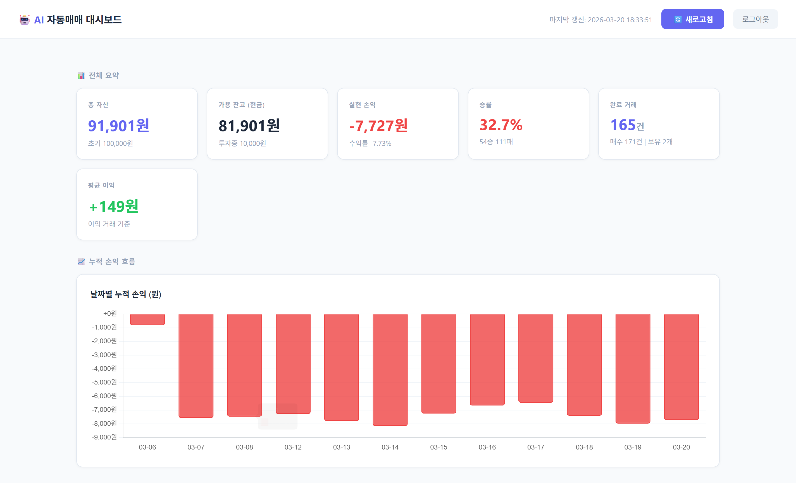
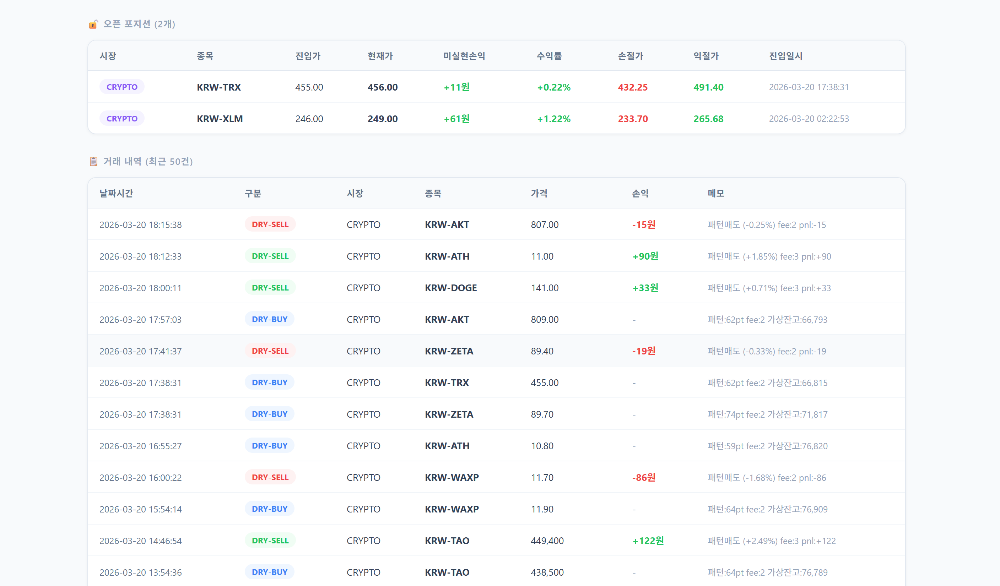
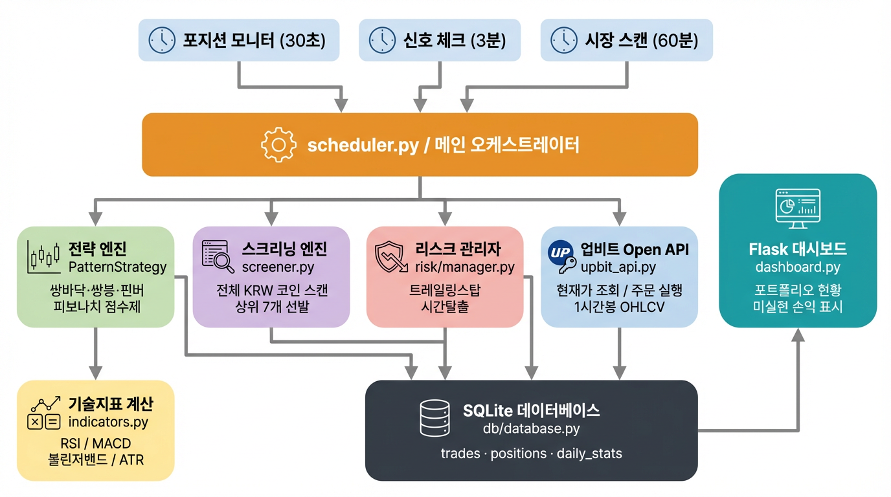

#  AI 자동매매 시스템 (ai_stack)

> Python 기반 암호화폐 자동매매 시스템 — 차트 패턴 분석, 실시간 포지션 모니터링, 웹 대시보드까지

[](https://python.org)
[](https://flask.palletsprojects.com)
[](https://sqlite.org)
[](https://upbit.com/open-api)
[](https://ubuntu.com)

---

##  프로젝트 개요

100,000원의 초기 자본으로 암호화폐 자동매매를 수행하는 AI 트레이딩 시스템입니다.

단순한 RSI/볼린저밴드 전략을 넘어 **차트 패턴 인식(쌍바닥·쌍봉·핀버·피보나치)**을 점수제로 결합한 복합 전략을 구현했습니다. Linux 서버에서 24시간 무중단 운영하며, 외부에서 웹 대시보드로 실시간 모니터링이 가능합니다.

### 핵심 목표

- 데이터 수집 → 종목 스크리닝 → 신호 생성 → 주문 실행 → 리스크 관리까지 **전 과정 자동화**
- Dry Run(모의투자) 모드로 충분한 데이터를 쌓은 후 실전 전환 가능한 구조
- 유명 트레이더(워렌 버핏, 제시 리버모어, 존 볼린저)의 투자 원칙을 코드로 구현

---

##  대시보드 스크린샷

> `http://서버IP:5000` 접속 → 로그인 후 실시간 포트폴리오 확인

| 섹션 | 내용 |
|---|---|
| 상단 요약 | 총 자산, 가용 잔고, 실현 손익, 승률 |
| 누적 수익 차트 | Chart.js 기반 날짜별 PnL 그래프 |
| 오픈 포지션 | 진입가 / **현재가** / **미실현 손익** / 수익률 / 손절가 / 익절가 |
| 거래 내역 | 전체 매수·매도 기록 및 손익 |





---

## ⚙️ 시스템 아키텍처



---

##  핵심 기능

### 1. 차트 패턴 기반 복합 전략 (`strategy/pattern_strategy.py`)

점수제 매수 시스템 — **55점 이상**일 때만 매수 신호 발생

| 조건 | 점수 | 설명 |
|---|---|---|
| MA20 > MA60 (상승추세) | 25점 | 골든크로스 추세 확인 |
| 쌍바닥 패턴 | 30점 | 두 저점이 ±3% 이내, V-V 구조 |
| 핀버(망치형) 캔들 | 25점 | 아래꼬리 > 몸통×2 |
| 거래량 급증 (1.5배↑) | 20점 | 세력 진입 신호 |
| RSI 35~55 반등 구간 | 15점 | 과매도 회복 초기 |
| MACD 히스토그램 반등 | 15점 | 모멘텀 전환 |
| 피보나치 골든존 (38~65%) | 20점 | 되돌림 매수 구간 |

**즉시 매도 조건** (패턴 매도):
- 쌍봉 패턴 (100% 신뢰도)
- 흑삼병 (Three Black Crows)
- 슈팅스타(역핀버) 캔들
- MA20 하향돌파, RSI>70 + MACD 하락

### 2. 3단계 리스크 관리

```python
# 1단계: 트레일링 스탑 (최고가 추적)
trailing_stop = max_price * (1 - 0.04)   # 최고가 대비 -4%

# 2단계: 고정 손절
stop_loss = entry_price * (1 - 0.05)     # 진입가 대비 -5%

# 3단계: 시간 탈출 (자본 묶임 방지)
if days_held >= 5 and pnl < 0:
    → 강제 매도
```

### 3. 30초 포지션 모니터 + 3분 신호 체크

- **30초**: OHLCV 없이 현재가만 조회 → 손절/익절/트레일링 즉시 반응
- **3분**: 1시간봉 200개 분석 → 새 매수 신호 탐색
- **60분**: 전체 KRW 코인 스캔 → 상위 7개 종목 재선발

### 4. 전체 KRW 코인 자동 스크리닝 (`data/screener.py`)

업비트 전체 KRW 마켓 코인을 자동 스캔해 점수 상위 종목만 선발

```
① 거래대금 50억 이상 필터 (유동성 확보)
② 기술지표 점수 산출 (모멘텀 + RSI/BB + 거래량 + 안정성)
③ 상위 7개 선발 → 포트폴리오 편입
```

---

##  프로젝트 구조

```
ai_stack/
├── scheduler.py          # 메인 오케스트레이터 (30초/3분/60분 스케줄)
├── dashboard.py          # Flask 웹 대시보드
├── main.py               # CLI 진입점
│
├── strategy/
│   ├── pattern_strategy.py  # 차트 패턴 복합 전략 (핵심)
│   ├── rsi_bb.py            # RSI + 볼린저밴드 전략
│   ├── portfolio.py         # 포트폴리오 관리 (비중 계산, 리밸런싱)
│   └── base.py              # 전략 기본 클래스
│
├── data/
│   ├── screener.py       # 전체 코인 스크리닝 엔진
│   ├── collector.py      # OHLCV 데이터 수집 (업비트/KIS/yfinance)
│   └── indicators.py     # 기술적 지표 계산 (RSI/MACD/BB/ATR)
│
├── api/
│   ├── upbit_api.py      # 업비트 Open API 연동
│   └── kis_api.py        # 한국투자증권 KIS API 연동
│
├── db/
│   └── database.py       # SQLite CRUD (거래/포지션/일별통계)
│
├── risk/
│   └── manager.py        # 리스크 관리 (MDD, 일일 손실 한도)
│
├── backtest/
│   ├── engine.py         # 백테스트 엔진
│   └── optimizer.py      # 파라미터 최적화
│
└── tools/
    ├── analyze_pnl.py    # 손익 분석 CLI
    ├── check_positions.py # 실시간 포지션 수익률 확인
    └── merge_db.py       # DB 병합 유틸리티
```

---

##  기술 스택

| 분류 | 기술 |
|---|---|
| **언어** | Python 3.11+ |
| **웹 프레임워크** | Flask 3.0, Flask-Login |
| **데이터베이스** | SQLite3 |
| **금융 데이터** | pyupbit, pykrx, yfinance |
| **데이터 처리** | pandas, numpy |
| **시각화** | Chart.js (대시보드), matplotlib |
| **스케줄링** | schedule |
| **인프라** | Linux Ubuntu, nohup, SSH |
| **API** | 업비트 Open API, KIS Developers API |

---

## 🚨 트러블슈팅 & 문제 해결 경험

프로젝트를 진행하며 실제 운영 환경에서 다음 문제들을 직접 진단하고 해결했습니다.

| 문제 | 원인 | 해결 |
|---|---|---|
| VM DNS 장애로 API 전면 차단 | `/etc/resolv.conf` 재부팅 시 초기화 | systemd-resolved 영구 DNS 설정 |
| 총 자산 1,300만원으로 폭등 | 미국주식 달러가격을 원화로 환산 안 함 | `entry_price × qty × usd_krw` 로직 수정 |
| 기존 포지션이 영원히 안 팔림 | 신규 스캔 미선발 종목은 모니터링 누락 | 보유 포지션 별도 추적 로직 추가 |
| 쌍바닥 패턴 오감지 | `lows` 배열로 고점 확인하는 버그 | `highs` 컬럼으로 V자 형태 검증 수정 |
| 7일 수익률이 전체 기간으로 계산 | `min()` → `max()` 인덱스 방향 오류 | 코드 리뷰로 발견 후 전체 수정 |
| 환율 캐시 미작동 | `.seconds`와 `.total_seconds()` 혼동 | `total_seconds()` 로 수정 |

---

##  실행 방법

### 환경 설정

```bash
git clone https://github.com/nk329/ai_stack.git
cd ai_stack
python3 -m venv venv
source venv/bin/activate          # Windows: venv\Scripts\activate
pip install -r requirements.txt
cp .env.example .env              # API 키 및 설정 입력
```

### Dry Run (모의투자) 실행

```bash
# 스케줄러 시작
python3 scheduler.py

# 백그라운드 실행 (Linux 서버)
nohup python3 scheduler.py > logs/scheduler_out.log 2>&1 &
```

### 대시보드 실행

```bash
python3 dashboard.py
# → http://localhost:5000 접속
```

### 포지션 현황 확인

```bash
python3 tools/check_positions.py
python3 tools/analyze_pnl.py
```

---

##  운영 현황

- **운영 기간**: 2026년 3월 ~
- **운영 환경**: Linux Ubuntu VM (24시간 무중단)
- **누적 거래 건수**: 200건+ (Dry Run 기준)
- **모니터링 주기**: 포지션 30초 / 신호 3분 / 스캔 60분

---

##  개발 회고

> "단순히 동작하는 코드"를 넘어 **실제 금융 데이터의 정합성**, **API 장애 대응**, **24시간 무중단 운영**을 경험했습니다.

- 처음엔 RSI 하나로 매매했지만 수익률 개선을 위해 점수제 복합 전략으로 발전
- VM DNS 장애, 데이터 정합성 버그 등 예상치 못한 운영 이슈를 직접 해결
- 코드 리뷰를 통해 `min/max 인덱스 오류`, `divide-by-zero`, `캐시 미작동` 등 6개 파일의 버그를 일괄 발견·수정
- 단순 CLI → Flask 웹 대시보드로 확장해 원격 모니터링 환경 구축

---

##  주의사항

- 이 프로젝트는 학습 및 포트폴리오 목적으로 제작되었습니다
- 실전 매매 전환 시 충분한 Dry Run 데이터 검증 필수
- 투자 손실에 대한 책임은 사용자 본인에게 있습니다

---

## 📄 라이선스

MIT License
